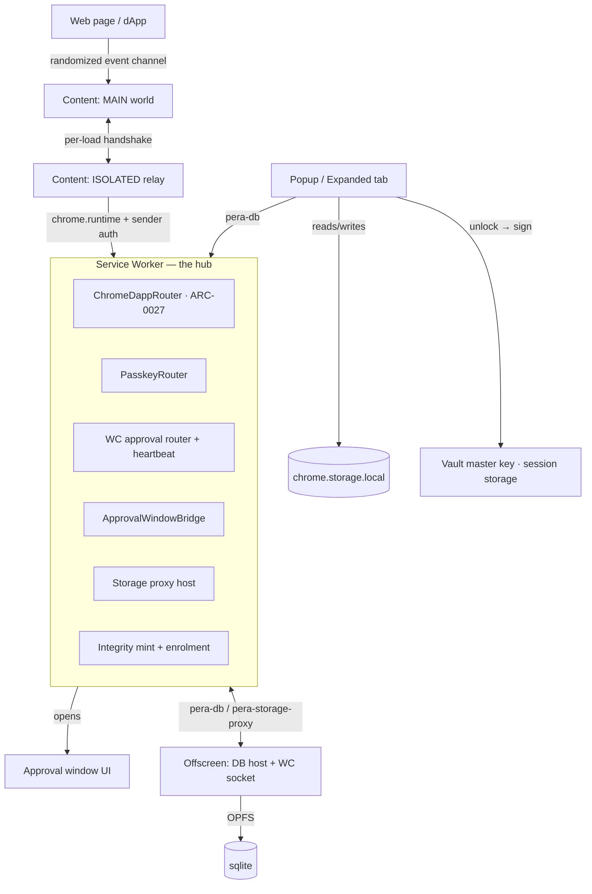

# Pera Wallet — Browser Extension Architecture

> Map of the browser extension, organized by **realm and trust boundary** — the
> way you have to reason about an MV3 wallet extension. Start here before reading any single file.
>
> Sources of truth: `apps/browser/manifest.json` (realms, permissions, CSP),
> `apps/browser/src/{background,content,offscreen}` (realm entry points),
> `extensions/platform-chrome` (message routing, storage, dApp/WC/passkey plumbing),
> `extensions/keystore-chrome` (vault, WebAuthn signer), `extensions/provider/src/keystore/*.web.ts`
> (the keystore engine).

---

## 1. The five realms

An MV3 extension is not one program — it is several isolated JS contexts with different
capabilities, lifetimes, and trust levels. Every correctness and security question starts
with "which realm is this running in, and what can it reach?"

| Realm                        | Entry / bundle                                                                      | Lifetime                                      | Owns                                                                                                                   | Can it sign?                      | Has DB?            |
| ---------------------------- | ----------------------------------------------------------------------------------- | --------------------------------------------- | ---------------------------------------------------------------------------------------------------------------------- | --------------------------------- | ------------------ |
| **Service worker**           | `background.js` (`src/background/index.ts`)                                         | Ephemeral, evicted ~30s idle, woken by events | Message routing hub, dApp/WC/passkey routers, offscreen lifecycle, integrity mint and enrolment, push, autolock alarms | **No**                            | No                 |
| **Offscreen document**       | `src/offscreen/runOffscreenApp.ts`                                                  | Long-lived (kept alive deliberately)          | The sqlite DB host (OPFS worker), warm-poll `SyncService`, the long-lived WalletConnect v1 socket                      | **No, vault deliberately absent** | **Yes (host)**     |
| **Content scripts**          | `src/content/*` (MAIN/ISOLATED pairs, plus the ISOLATED-only integrity check relay) | Per-tab, per-navigation                       | Page↔extension bridges (ARC-0027, WebAuthn interception, Discover, Bidali, connect-modal, integrity check page)        | No                                | No                 |
| **UI: popup + expanded tab** | `popup.html` → RN-web app (`apps/mobile` Metro build)                               | Ephemeral (popup) / user-controlled (tab)     | The React app, vault **unlock**, transaction signing, approval surfaces                                                | **Yes** (vault unlocked here)     | Client of the host |
| **Web-shell boot**           | `apps/mobile/src/App.web.tsx` → `AppShell.web.tsx`                                  | With the UI realm                             | Hydrate → dynamic-import boot, storage-proxy shim install, integrity-token sync                                        | n/a                               | n/a                |

**The two toolchains trap.** The service worker is bundled by **esbuild** (reads
`packages/*/dist`); the popup/UI is bundled by **Metro** (reads `packages/*/src`). The same
`.zip` can therefore carry _different baked config_ on the two sides. `index.ts` prints the
resolved config identity on both sides precisely so they can be diffed — a mismatch presents
as "requests going to the wrong place," which looks like a backend bug but is a build bug.

---

## 2. Topology and message routing

The service worker is the **hub**: every cross-realm message is a `chrome.runtime` message
tagged with a `scope`. Offscreen has no native `chrome.storage`, so the SW even proxies that.

**Message scopes** (the routing table — each is a `*_SCOPE` constant in `platform-chrome`):

| Scope                                                                                                     | Between              | Purpose                                                           |
| --------------------------------------------------------------------------------------------------------- | -------------------- | ----------------------------------------------------------------- |
| `pera-db`, `pera-db-control`                                                                              | UI/offscreen ↔ SW    | DB exec proxy; `ensure-offscreen` lifecycle                       |
| `pera-storage-proxy`, `pera-storage-event`                                                                | offscreen ↔ SW       | `chrome.storage` served to the offscreen doc + `onChanged` relay  |
| `pera-dapp-approval`                                                                                      | SW ↔ approval window | ARC-0027 connect/sign approval                                    |
| `pera-wc-control`, `pera-wc-request`, `pera-wc-error-notice`, `pera-wc-pair-outcome`, `pera-wc-page-pair` | SW ↔ offscreen ↔ UI  | WalletConnect control, sign requests, errors, pairing             |
| `pera-webauthn-relay`                                                                                     | content ↔ SW         | Intercepted `navigator.credentials` ceremonies → passkey approval |
| `pera-integrity-enrol`                                                                                    | UI → SW              | An extension page asks whether it should host the integrity check |

---

## 3. Trust boundaries

### 3.1 Page → extension (the hostile edge)

Content scripts are injected into **every https page** (`matches: https://*/*`). They share
`chrome.runtime.onMessage` with the whole extension, so the page is treated as hostile:

- **Randomized per-load event channel** (`content/channel.ts`): MAIN↔ISOLATED event names are
  generated per document load via a one-shot handshake, so page code cannot forge relay
  traffic or responses.
- **`isTrustedExtensionPageSender`** (`platform-chrome/trusted-sender.ts`): gates on
  `sender.id === runtime.id` **and** `sender.url` starting with `chrome-extension://<id>/`.
  A content script's `sender.url` is the _web page_, never an extension URL — this is what
  separates "one of our own pages" from "a script we shipped into every tab."
- **Webview bridge** (Discover/Bidali) authenticates on browser-stamped `port.sender.origin`.
- The **enforced** dApp boundary is the **account-selection approval window**, not the content
  script. `CONNECT_MODAL_PAIR_EVENT` has a fixed, page-discoverable name _by design_ — see the
  note in `channel.ts`; pairing is inert until the user approves accounts.

### 3.2 The vault (key custody)

Password → **Argon2id** KEK (`ARGON2_MEMORY_KIB=19456, ITERATIONS=2`; OWASP baseline) → unwrap
the master key. Legacy PBKDF2 blobs (`600k` iters) are re-wrapped as Argon2id on next unlock.

- **Wrapped** master key blob → `chrome.storage.local` (`vault:wrapped-master-key`, survives restart).
- **Unwrapped** master key → `chrome.storage.session` (`vault:master-key`), `TRUSTED_CONTEXTS`,
  memory-only, gone on browser close.
- Autolock alarm + lockout counter (`vault:auto-lock-minutes`, `vault:lockout`).
- Optional passkey/PRF unwrap path (`vault:wrapped-master-key-prf`, `vault:prf-credential-id`).

### 3.3 Signing

The **offscreen document deliberately has no vault** — so it cannot sign. Signing happens only
in the **UI realm**, where the vault is unlocked. WalletConnect requests that survive in the
offscreen socket are **forwarded to the SW**, which opens an approval surface in the UI.
Keys are held and used by the `@algorandfoundation/keystore-web` engine
(`extensions/provider/src/keystore/createKeystore.web.ts`), whose driver resolves the vault master
key on every seal and open, so a lock in any context stops the next operation everywhere.

### 3.4 App integrity (attribution, not attestation)

SW-owned non-extractable **P-256** keypair in IndexedDB (`pera-integrity`), minting a
short-lived JWT into `chrome.storage.session`. Three build flags gate it, all default off:
`WEB_INTEGRITY_MINT_ENABLED` (the mint loop), `WEB_INTEGRITY_BEARER_ENABLED` (the UI realm
attaches the token to its requests) and `WEB_INTEGRITY_ENROL_ENABLED` (enrolment, which also needs
the mint flag).

Enrolment makes that key a revocable identity by binding it to a Cloudflare Turnstile solve on our
check page. The popup or expanded tab asks the SW over `pera-integrity-enrol`; the SW decides, and
answers with a check URL carrying a per-attempt token. The page frames it hidden, the check page's
content script relays the solve to the SW over a `pera-integrity-check:<token>` port, and the SW
enrols. The attempt lives in `chrome.storage.session` so worker eviction loses nothing, and a
focused tab is the fallback only while the asking page is still open. The handshake, validation
rules and failure handling are specified in `docs/WEB_INTEGRITY_ENROLMENT_CONTRACT.md`.

---

## 4. Storage map

| Store                                         | Keys                                                                                                                                                                                                                                                                                                                                                       | Notes                                                                                                                                                                                                 |
| --------------------------------------------- | ---------------------------------------------------------------------------------------------------------------------------------------------------------------------------------------------------------------------------------------------------------------------------------------------------------------------------------------------------------- | ----------------------------------------------------------------------------------------------------------------------------------------------------------------------------------------------------- |
| `chrome.storage.local`                        | `kv:accounts-store`, `kv:network-store`, `kv:custom-network-store`, `kv:polling-store`, `kv:wallet-connect-store`, `kv:settings-store`; `device:installation-id`; `vault:wrapped-master-key(+prf,+cred-id)`, `vault:auto-lock-minutes`, `vault:lockout`; dApp permissions; legacy-migration sentinels; `webauthnInterceptionEnabled`; TanStack Query cache | `kv:*` values are JSON **strings** (the KV service stringifies). `device:installation-id` is deliberately root-level (not `kv:`) so it survives "clear data". `unlimitedStorage` lifts the 10 MB cap. |
| `chrome.storage.session` (`TRUSTED_CONTEXTS`) | `vault:master-key`, `integrity:token`, `integrity:backoff`, `integrity:enrol-attempt`, `integrity:enrol-backoff`, `integrity:enrol-needed`                                                                                                                                                                                                                 | Memory-only, cleared on browser close. The unwrapped master key lives **only** here.                                                                                                                  |
| **IndexedDB** `pera-integrity`                | `install-key`, `enrolment:<network>`                                                                                                                                                                                                                                                                                                                       | Non-extractable P-256 keypair (private half never leaves), and one enrolment marker per network.                                                                                                      |
| **OPFS**                                      | sqlite database                                                                                                                                                                                                                                                                                                                                            | Owned by the offscreen DB-worker; evictable without `unlimitedStorage`.                                                                                                                               |

---

## 5. Manifest posture (the security envelope)

- **CSP**: `script-src 'self' 'wasm-unsafe-eval'` — no remote code (MV3 + Web Store policy). This
  is _why_ Turnstile enrolment (integrity step 2) must be hosted off-extension.
- **`externally_connectable: { ids: [] }`** — explicitly closed. No `onMessageExternal` listener
  exists; the empty allowlist keeps a future one from silently inheriting an open door.
- **`host_permissions`** are enumerated (perawallet, algonode, baanx, bidali, firebase/FCM, GA,
  Sentry) — not `<all_urls>`.
- **Permissions**: `storage`, `unlimitedStorage`, `alarms`, `offscreen`, `notifications` — each
  documented inline in the manifest with _why it is load-bearing_.

---

## 6. Ported code

`keystore-chrome/src/keystore/` holds the key types and error class the WebAuthn signer needs,
ported verbatim from `@algorandfoundation/keystore@1.0.0-canary.17` and carrying `oxlint-disable …
upstream style preserved` banners. Review them by **diffing against upstream**, not by local
restyling. Everything else in the package (vault, auto-lock, lockout, passkey unlock, the WebAuthn
signer) is our own code.

On web, Metro still resolves `@algorandfoundation/react-native-keystore` to this package (see
`apps/mobile/metro.config.js`): shared barrels import it statically, and the real package would pull
native modules into the web bundle. It exports none of that package's names, so they read as
`undefined` there; the code paths that use them never run on web. `keystore:*` entries in
`chrome.storage.local` on older profiles are unread by any code path.
